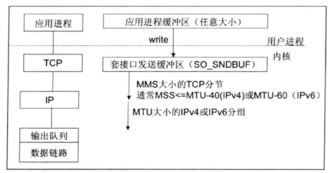
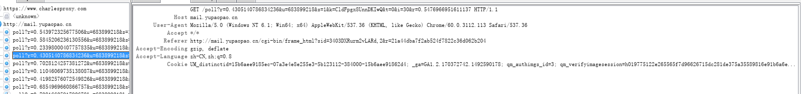

http://ifeve.com/netty5-user-guide/

http://netty.io/wiki/user-guide.html

https://github.com/wuyinxian124/nettybook2

[高性能IO模型浅析](http://www.cnblogs.com/fanzhidongyzby/p/4098546.html)

[IO - 同步，异步，阻塞，非阻塞 （亡羊补牢篇）](http://blog.csdn.net/historyasamirror/article/details/5778378)

Java1.4以前问题
1. 无数据缓冲区，存在IO性能问题
2. 无C/C++中的channel概念，只有stream
3. 同步阻塞BIO，通常导致通信被长时间阻塞
4. 支持字符集有限，硬件移植性不好

Linux 将所有外部设备看作一个文件来操作，对一个文件读写会调用内核提供的系统命令，返回一个file descriptor 文件描述符
而对一个socket也有相应的描述符，socketfd，描述符就是一个数字，指向内核中的一个结构体（文件路径，数据区等一些属性）

《UNIX网络编程》

Unix对IO模型分类
1. 阻塞型

    以socket为例，在进程空间调用recvfrom，其系统调用直到数据包到达且被复制到应用进程缓冲区中或发生错误时才返回，在此期间会一直等待
    
2. 非阻塞型

    应用层recvfrom到内核时，如果数据缓冲区没有数据，就直接返回一个EWOULDBLOCK错误，一般都对非阻塞型IO模型进行轮询这个状态，看内核
    是否有数据到来
    
    
3. 复用模型
    
    Linux提供select/poll，进程通过将一个或多个fd传递给select或poll系统调用，阻塞在select上，这样select/poll可以帮我们
    侦测多个fd是否处于就绪状态。select/poll是顺序扫描fd是否就绪，而且支持的fd数量有限，因此它的使用受到了制约。
    Linux还提供了epoll系统调用，epoll基于事件驱动方式替代顺序扫描，因此性能更高。当有fd准备就绪时，立即回调函数rollback。
    
    
4. 信号驱动型

    首先开启套接口信号驱动IO功能，并通过系统调用sigaction执行一个信号处理函数（此系统调用立即返回，进程继续工作，它是非阻塞的）
    当数据准备就绪时，就为该进程生成一个sigio信号,通过信号回调通知应用程序调用recvfrom来读取数据，并通知主循环函数处理数据
    
    
    
5. 异步IO
    
    告知内核启动某个操作，并让内核在完成整个操作后（包括将数据从内核复制到用户的缓冲区）通知我们。这种模型与信号驱动模型主要的
    区别在于：信号驱动IO由内核通知我们何时开始一个IO操作；异步模型由内核通知我们IO操作何时已完成
    
    
    
五种模型对比

   
   
   Java NIO的核心类库多路复用器Selector就是基于epoll技术实现的
   
epoll优势
1. 支持一个进程打开的socket fd不受限制（仅受限于操作系统的最大文件句柄数）
    select的fd_size默认为1024，但epoll在1G机器上大约10w
    
    cat /proc/sys/fs/file-max 
2. IO 效率不会随着fd数目的增加而线性下降
3. 使用mmap加速内核用户空间的消息传递
4. epoll的api更简单

NIO类库简介（new io or non-block io）

1. Buffer 缓冲区

在面向流IO中，数据的读取与写入都是在stream对象中进行的，而NIO中，数据都是通过缓冲区操作的，它实质上是一个数组（当然它不仅仅是数组，还
提供了对数据结构化访问以及维护读写位置的信息）

* ByteBuffer
* CharBuffer
* ShortBuffer
* IntBuffer
* LongBuffer
* FloatBuffer
* DoubleBuffer

2. Channel通道

网络数据通过Channel读写，Channel是全双工，可以用于读写或者二者同时进行，而流只在一个方向流动

3. Selector 多路复用器

多路复用器提供选择已经就绪的任务的能力。简单来讲，Selector会不断轮询注册在其上的Channel，如果某个Channel上面发生
读或者写事件，这个Channel就会处于就绪状态，会被Selector轮询出来，然后通过SelectionKey可以获取就绪的Channel集合，
进行后续的IO操作。

NIO2.0

对应与UNIX事件驱动IO（AIO）。它不需要通过多路复用器Selector对注册的通道进行轮询操作即可实现异步读写

netty or java io选择

TCP 粘包/拆包
1. 导致原因
*  缓冲区划分，应用程序写入字节大小大于套接口发送缓冲区大小
*  进行MSS大小的TCP分段
*  以太网帧的payload大于MTU进行IP分段

MTU：maximum transmission unit，最大传输单元，由硬件规定，如以太网的MTU为1500字节。
MSS：maximum segment size，最大分节大小，为TCP数据包每次传输的最大数据分段大小，一般由发送端向对端TCP通知对端在每个分节中能发送的最大TCP数据。MSS值为MTU值减去IPv4 Header（20 Byte）和TCP header（20 Byte）得到。
分片：若一IP数据报大小超过相应链路的MTU的时候，IPV4和IPV6都执行分片(fragmentation)，各片段到达目的地前通常不会被重组(re-assembling)。IPV4主机对其产生的数据报执行分片，IPV4路由器对其转发的数据也执行分片。然而IPV6只在数据产生的主机执行分片；IPV6路由器对其转发的数据不执行分片。

例如：一个以太网上的主机和一个令牌环网上的主机间建立连接，其中以太网上主机通告的MSS为1460，令牌环网上主机通告的MSS为4096。观察分组，在两个方向上都找不到大于1460字节的数据，为什么？
        令牌环网上发送到以太网的数据大小不大于1460字节的原因是因为以太网上主要通告的MSS值就为1460个字节，所以令牌环网上发送出去的数据的长度不能够大于MSS值；令牌环网上主机通告的MSS值为4096，也即是说以太网能够发送到令牌环网上的TCP净荷值为4096，但是以太网的MTU值又是由硬件所决定的，最大只支持1500（包括IP头至少20B和TCP头至少20B），为避免分片，因此以太网发送到令牌环网的数据的净荷也为1500-20-20=1460B，所以两个方向的净数据长度不会大于1460字节。 

2. 问题解决策略
* 消息定长
* 在包尾增加回车换行符
* 消息头和消息体，消息头中固定位置作为消息体的长度
* 更复杂的应用层协议

Netty利用LineBasedFrameDecoder等多种解码器解决TCP粘包
1. LineBasedFrameDecoder依次遍历ByteBuff中的可读字节，判断是否有"\r\n"或者"\n",如果有，就以此位置为结束位置，
    从可读索引到结束位置区间的字节就组成一行。
    它是以换行符为结束标志的解码器，支持携带结束符或者不携带结束符两种解码方式，同时支持配置单行的最大长度。
    如果连续读取到最大长度后仍然没有发现换行符，就会抛出异常，同时忽略之前读到的异常码流
2. StringDecoder就是将接收到的对象转换成为字符串，然后继续调用后面的handler
    
DelimiterBasedFrameDecoder  分隔符

FixedLengthFrameDecoder  定长 (如果是半包消息，则会等待下个包到达后进行拼包，直到读取一个完整的包)
* 如何辨别包结束了？

Netty编解码

Java序列化的缺点 java.io.Serializable

1. 无法跨语言
2. 序列化后码流太大（例子貌似有点问题，序列化是整个对象，而另外的方法仅仅序列化了值）
3. 序列化性能太低

业界主流编解码框架
1. Google =  ProtoBuf
2. Facebook = Thrift
3. JBoss = Marshalling

自定义长度报文编解码
com.bao.fixLength

NETTY && HTTP

HTTP请求消息 (HttpRequest)
* 请求行
    Method Request-URI HTTP-VERSION CRLF(回车和换行)
* 消息头
* 请求正文

HTTP响应消息 (HttpResponse)
* 状态行
* 消息报头
* 响应正文

user.dir是jvm的系统属性，我们知道System.property可以获取jvm系统属性值,
所以System.property("user.dir")路径就是文件的默认保存路径。

user.dir与user.home
user.dir：用户的当前工作目录，在linux下与pwd(print working directory) 命令相同
user.home:用户的主目录